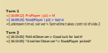

# Wesnoth duel replay parser

Extract from a [Wesnoth](https://wesnoth.org) **replay**: game settings, sides info, chat log.

[](https://semver.org/spec/v2.0.0.html) [](https://www.conventionalcommits.org/en/v1.0.0/) [](http://commitizen.github.io/cz-cli/)

<!-- \*with [Angular Commit Message Conventions](https://github.com/angular/angular/blob/master/CONTRIBUTING.md#-commit-message-format) -->


<!-- TOC depthfrom:2 -->

- [Features](#features)
- [User's manual](#users-manual)
- [Users FAQ](#users-faq)
- [API](#api)
    - [REQUEST](#request)
    - [RESPONSE](#response)
- [Installing](#installing)
- [Afterword](#afterword)
- [Software Disclaimer](#software-disclaimer)
- [Donation sponsorship Disclaimer](#donation-sponsorship-disclaimer)
- [Links](#links)
- [UI screenshots](#ui-screenshots)

<!-- /TOC -->

## Features

App consists from:

- NodeJS back-end with web-server `fastify` and API endpoint;
- Front-end (at the same web-server).

This app is for parsing replays from official server 'replays.wesnoth.org'. App gather game settings, sides info, and chat log with unique feature - show all chat lines with binding to current turn number.

I wish it could help somehow tournament organizers.\
Players also could use it to get quick glance at replay.

Although this app created for 1v1 replays (for 2 sides/players), it still could be used with any replay with some disclaimers - for example app would show chat log, but there could be wrong colorizing and so on.

Example of colorized chat log with binding to turn numbers:



## User's manual

1. Find a replay at [official Wesnoth replays server](https://replays.wesnoth.org). Supported only 1.14.X versions (probably other versions could work too).
2. Copy link to replay (example: [link](<http://replay.wesnoth.org/1.14/2021/03/22/2p__Weldyn_Channel_Turn_14_(155976).bz2>)).
3. Open app [https://wespar.onrender.com/](https://wespar.onrender.com/).
4. Insert link and press button.
5. Server would download that replay, decompress and parse info.
6. Result would be shown.

## Users FAQ

Q: Does it say if a player picked?\
A: No, I could not gather such info from replay file structure.

Q: Why there are no factions?\
A: There is no simply universal way to get factions from replay structure. So, there are only leaders as faction's representative.

Q: Why there are "unknown_time" for messages from server?\
A: It's my placeholder, because there are really no timestamp for server's messages in replay structure. Interesting, that if you render replay with Wesnoth-client, there would be your local time.

Q: Could you know for sure from replay who was winner?\
A: _There currently is nothing recorded about who won or lost. The issue is that while it would be possible to determine the winner in the case of a leader death (in regular scenarios) or if a side surrendered, there's no way to determine a winner (ie in case of a rage quit) or if a winner even needs to be determined (ie in case of a game being saved in order to be continued later)._ (**Pentarctagon**, Wesnoth forums)

## API

### REQUEST

`POST` to path `/url` with JSON payload:

```json
{
  "urlFileForParsing": "https://replays.wesnoth.org/1.14/2021/04/30/2p__Swamp_of_Dread_Turn_10_(31797).bz2"
}
```

### RESPONSE

JSON would be like this:

```json
{
  "errorInRequest": null or string,
  "answer": {
    "errorWhileParsing": null or string,
    "meta": null or {},
    "gameSettings": null or {
      "addons": null or [{}],
      "settings": null or {},
      "turns": null or integer
    },
    "sides": null or [{}],
    "chat": null or [{}],
    "mTime": null or integer
  }
}
```

Example for cURL:

```sh
APP_URL="https://wespar.onrender.com"
ENDPOINT="/url"

curl --header "Content-Type: application/json" \
     --request POST \
     --data '{"urlFileForParsing":"https://replays.wesnoth.org/1.14/2021/03/22/2p__Weldyn_Channel_Turn_14_(155976).bz2"}' \
     $APP_URL$ENDPOINT
```

## Installing

For GNU/Linux:

```sh
git clone https://github.com/amokmen/wespar/
cd wespar
npm install
npx husky install
npm run start
```

Starting point for back-end is `./index.js` and config is at `./config.js`.

ENV variables that app could use: `PORT` (web-server listening port number), `LOG_LEVEL` and `LOG_LEVEL_FASTIFY` (trace, debug, info, warn, error, fatal, silent).

## Afterword

This is a hobby/learning project and I want to develop it in my way. I could make life a bit easier for me if use official Wesnoth WML parser for creating JSON from WML. But I intentionally decided to not do this.

It was rather painful experience trying to research and understand Wesnoth replay file structure. More words and pictures are [here](docs/pain.md), including monstrous algorithm of parsing.

And remember:\


P. S. I spent more than 2 month for active developing this app (including time for tooling).

<!-- ## Stack

This project was developed using:

- NodeJS v14.16.0
- "fastify" (with plugins "fastify-static", "fastify-compress") as web-server for both back-end and front-end
- "pino" (and "pino-pretty") as logger
- "got" as HTTP-requester -->

## Software Disclaimer

- This software is provided "as is," and you use the software at your own risk.
- There are no any warranties.

## Donation (sponsorship) Disclaimer

- All donations are non-refundable.
- Therefore, **donors** explicitly release **recipient** from any restrictions on how those funds are spent.
- No goods or services were provided in return for any contribution.

## Links

1. [Original Wesnoth **WML parser** - could be used to convert replay files to JSON or XML.](https://github.com/wesnoth/wesnoth/blob/master/data/tools/wesnoth/wmlparser3.py)
2. [Original Wesnoth **WML indent utility** - could be used to indent WML files for easy understanding inner structure.](https://github.com/wesnoth/wesnoth/blob/master/data/tools/wmlindent)
3. [Meme generator.](https://imgflip.com/memegenerator)
4. [Cool service for showing key codes, including mobile devices.](https://keycode.info/)
5. [Great free app for online creating diagrams - Draw.io](https://app.diagrams.net/)

## UI screenshots

Before work:


After work:


