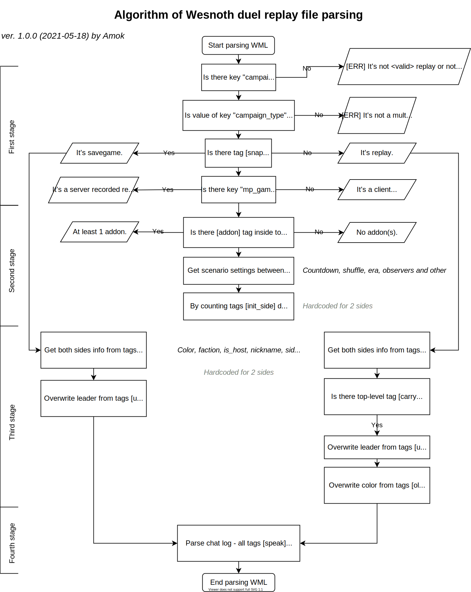
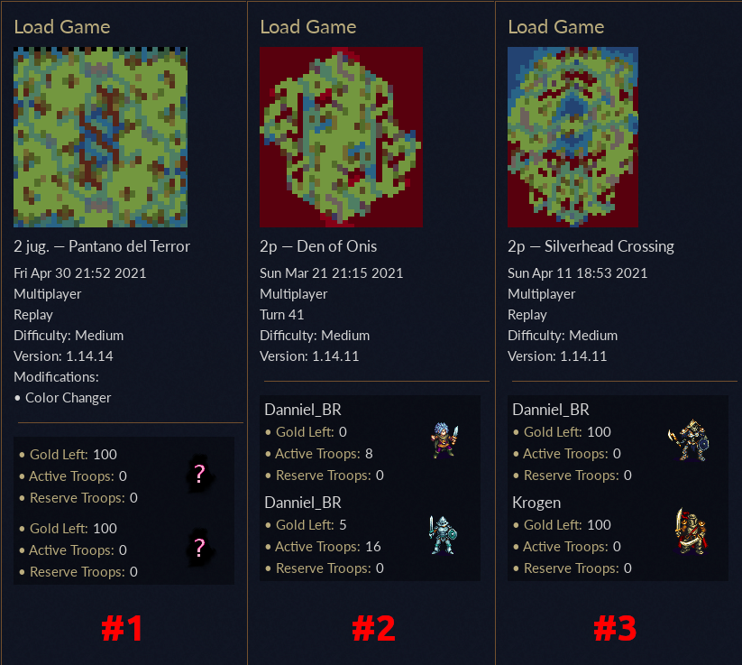
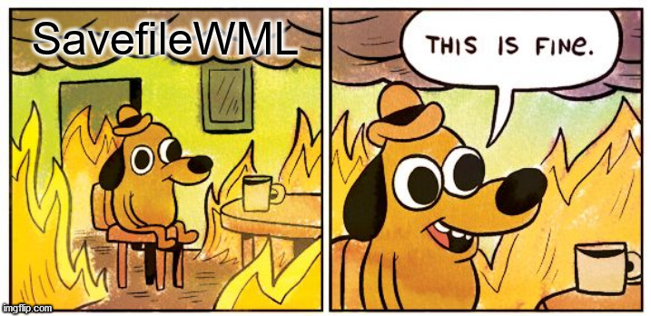

# Retrospective "What a pain was to research Wesnoth replay file structure"

_Firstly, I want to thank everyone who helps me: **Soliton** and other Wesnoth developers at [official Wesnoth Discord channel](https://discord.gg/battleforwesnoth)._

<!-- TOC depthfrom:2 -->

- [Sharing of my pain](#sharing-of-my-pain)
- [Wesnoth devs could not properly parse own WML too](#wesnoth-devs-could-not-properly-parse-own-wml-too)
- [Farewell words about SavefileWML](#farewell-words-about-savefilewml)

<!-- /TOC -->

## Sharing of my pain

Creating this app was really (I meant it - REALLY) harsh experience. My expectation was like "_It's easy task: I know what information I need from replay file - so I would just find it in a file and take it! Easy-peasy. 2 days max!_" I spent A LOT OF time only for researching replay file structure in reality. Because this structure is VERY VARIABLE and could have a lot of variants depending of many things.

My modest efforts are here:\

Upd.: No, I just must make official statement: Wesnoth replay file structure are almost randomly generated! :) It's a joke of course, but only a little part there is a joke. You could open 5 replays and each could have different structure - tags could be or could not be, same tag could contain some info or could not and so on! And addons literally add mess!

I was really tired. Even got headache. It's hard to do things if you could not understand LOGIC of what and why happening. I created series of replays with different options while trying to understand structure. If I know all of this before - I would never start to implement this app...

## Wesnoth devs could not properly parse own WML too

It's amazing, but even Wesnoth developers could not properly parse own replays. Same reasons - it's pure **chaos** territory :)

Screenshots from 1.14.11 Wesnoth client, "Load" dialogue:

Example#1:

- no both players nicknames
- no leaders
- no sides colors
- no turns number displayed

Example#2 (it's savegame):

- nicknames identical - it's because parser got nicknames from the end of game, not from start; and there is second player already left game - so, no his nickname displayed

Example#3:

- seems good overall: there are nicknames, leaders, colors.

## Farewell words about SavefileWML

_2021-06-01 update: suddenly I discovered that in this [replay](<https://replays.wesnoth.org/1.14/2021/05/29/2p_-_Marshy_Fill_Turn_25_(7281).bz2>) my parser showing not all chat lines! After researching this text appears:\_

My farewell words for anybody who is going to work with [SavefileWML](https://wiki.wesnoth.org/SavefileWML) (at least _server generated_ SavefileWML): **Beware! Think twice before starting to work with SavefileWML - it's a pure mess**.

And I am personally would NEVER EVER again touch SavefileWML. No way.

Here are my statements:

1. SavefileWML is a mess.
2. It's mess by design.

There is officially could be situation when in SavefileWML would be 2 (two) instances of same (SAME!) top-level tag `[replay]`. It's pure insane! Imagine situation, when W3C allow to insert in HTML two times `<body>` tag! Nonsence! But in SavefileWML - it's totally OKAY.

And this is by design, according to commit `ac9628e`. Comment from that commit:

> "This can result in having 2 [replay] at toplevel since level\_ can contain one already. But the client can handle this (simply merges them)."

