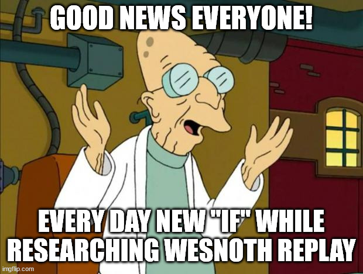

# Retrospective "What a pain was to research Wesnoth replay file structure"

Creating this app was really (I meant it - REALLY) harsh experience. My expectation was like "_It's easy task: I know what information I need from replay file - so I would just find it in a file and take it! Easy-peasy. 2 days max!_" I spent A LOT OF time only for researching replay file structure in reality. Because this structure is VERY VARIABLE and could have a lot of variants depending of many things. My modest efforts are here: 

Upd.: No, I just must make official statement: Wesnoth replay file structure are almost randomly generated! :) It's a joke of course, but only a little part there is a joke. You could open 5 replays and each could have different structure - tags could be or could not be, same tag could contain some info or could not and so on! And addons literally add mess!

I was really tired. Even got headache. It's hard to do things if you could not understand LOGIC of what and why happening. I created series of replays with different options while trying to understand structure. If I know all of this before - I would never start to implement this app...

Anyway, I want to thank everyone who helps me: **Soliton** and other Wesnoth developers at [official Wesnoth Discord channel](https://discord.gg/battleforwesnoth).

P. S. It's amazing, but even Wesnoth developers could not properly parse own replays. Same reasons - it's pure **chaos** territory :)

Screenshots from 1.14.11 Wesnoth client, "Load" dialogue:

Example#1:

- no both players nicknames
- no leaders
- no sides colors
- no turns number displayed

Example#2 (it's savegame):

- nicknames identical - it's because parser got nicknames from the end of game, not from start; and there is second player already left game - so, no his nickname displayed

Example#3:

- seems good overall: there are nicknames, leaders, colors.
